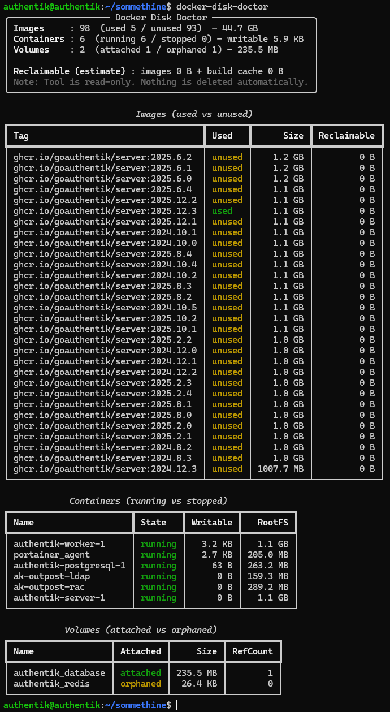

# Docker Disk Doctor

Docker Disk Doctor is a safe, explain-first CLI tool that shows **how Docker is using disk space** and what is **safe to clean** — without blindly running `docker system prune`.

Built from real homelab and infrastructure pain.

## Why this exists

Docker is great… until your disk suddenly fills up.

At that point, most people run:

```bash
docker system prune -a
```

…and *hope for the best*.

Docker Disk Doctor exists to answer one simple question **before you delete anything**:

> What exactly is using my disk space, and what is safe to remove?

This tool is **safe-by-default**. It explains first, so you can decide.

## Features

- Full breakdown of Docker disk usage:
  - Images (used vs unused)
  - Containers (running vs stopped)
  - Volumes (attached vs orphaned)
- Actual disk usage (MB / GB)
- Clear, readable CLI tables
- Safe-by-default cleanup (nothing is deleted unless you explicitly confirm)
- Designed for homelabs, servers, and real systems

## Screenshot

<details>
<summary>Click to expand example output</summary>



</details>

## Installation

### Prerequisites

You need `pipx` installed.

On most Debian/Ubuntu-based systems:

```bash
sudo apt update
sudo apt install -y pipx
pipx ensurepath
```

You may need to open a **new shell** after running `pipx ensurepath`.

### Install Docker Disk Doctor

Install directly from GitHub:

```bash
pipx install git+https://github.com/andreasrevdal/docker-disk-doctor.git
```

This installs the `docker-disk-doctor` command globally for your user.

> Note: This project is currently installed directly from GitHub.  
> A PyPI release (`pipx install docker-disk-doctor`) will come later.

## Usage

Show disk usage breakdown:

```bash
docker-disk-doctor
```

This will display:
- Used vs unused images
- Running vs stopped containers
- Attached vs orphaned volumes

No changes are made to your system.

## Cleanup (optional)

Docker Disk Doctor is **safe-by-default**.

Nothing is deleted unless you explicitly confirm it.

### Preview cleanup (dry-run)

```bash
docker-disk-doctor --clean --all
```

### Apply cleanup (unused images + orphan volumes)

```bash
docker-disk-doctor --clean --all --apply --yes
```

You can also target only one type:

```bash
docker-disk-doctor --clean --images
docker-disk-doctor --clean --volumes
```

## Support

If this tool saved you time, stress, or disk space,  
consider buying me a compute ☕

https://buymeacoffee.com/revdal

## License

MIT License
